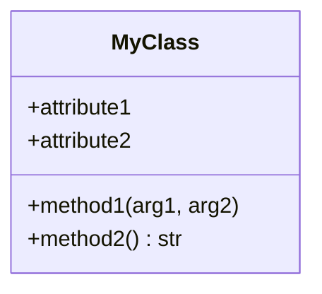
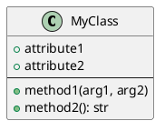

# PyArchViz

**Python Architecture Visualizer** - Generate software architecture diagrams from Python code.

[](https://www.python.org/downloads/)
[](https://opensource.org/licenses/MIT)

PyArchViz analyzes Python codebases and automatically generates various types of architecture diagrams to help you understand and document your project's structure.

## Features

### Core Features

- 🏗️ **Multiple Diagram Types**
  - Class diagrams (UML-style with inheritance, methods, and attributes)
  - Dependency graphs (module and package relationships)
  - Call graphs (function/method call relationships)
  - Package structure diagrams (hierarchical project organization)

- 📊 **Multiple Output Formats**
  - **Mermaid** - Markdown-compatible, GitHub-friendly
  - **PlantUML** - Standard UML format
  - **GraphViz** - Direct image output (PNG, SVG, PDF, JPG)

- 🔧 **Highly Configurable**
  - Filter by depth, visibility (public/private)
  - Include/exclude external dependencies
  - Customizable layout engines (GraphViz)
  - Exclude patterns for test files and more

- 💻 **Rich CLI Experience**
  - Beautiful terminal output with progress indicators
  - Detailed code analysis and statistics
  - Batch generation of multiple diagram types

## Installation

### Using uv (recommended)

```bash
uv pip install pyarchviz
```

### Using pip

```bash
pip install pyarchviz
```

### From source

```bash
git clone https://github.com/torsteinsornes/pyarchviz.git
cd pyarchviz
uv sync
```

## Quick Start

Generate all diagram types for your project:

```bash
pyarchviz generate ./my_project --output ./diagrams
```

This will create:
- `diagrams/class_diagram.mmd`
- `diagrams/dependency_graph.mmd`
- `diagrams/call_graph.mmd`
- `diagrams/package_structure.mmd`

## Usage

### Generate Diagrams

**Basic usage:**
```bash
pyarchviz generate /path/to/project
```

**Specify output directory and format:**
```bash
pyarchviz generate ./src --output ./docs/diagrams --format plantuml
```

**Generate specific diagram types:**
```bash
pyarchviz generate ./src --class-diagram --dependency-graph
```

**Generate all formats:**
```bash
pyarchviz generate ./src --format all
```

**Exclude test files:**
```bash
pyarchviz generate ./src --exclude "test_*" --exclude "*_test.py"
```

**Configure class diagrams:**
```bash
# Include private members and limit depth
pyarchviz generate ./src --class-diagram --include-private --max-depth 2

# Exclude methods and attributes for high-level overview
pyarchviz generate ./src --class-diagram --no-methods --no-attributes
```

**GraphViz options:**
```bash
# Use different layout engine and output format
pyarchviz generate ./src --format graphviz \
  --graphviz-layout neato \
  --graphviz-format svg
```

### Analyze Code

Get statistics and insights about your codebase:

```bash
pyarchviz analyze ./src
```

This displays:
- Number of modules, classes, and functions
- Import relationships
- External dependencies
- Detailed module breakdown

### View Supported Formats

```bash
pyarchviz formats
```

## Examples

### Example 1: Django Project

```bash
# Generate dependency graph excluding migrations and tests
pyarchviz generate ./myapp \
  --dependency-graph \
  --exclude "migrations/*" \
  --exclude "*/tests/*" \
  --include-external \
  --format mermaid
```

### Example 2: Package Documentation

```bash
# Generate class diagrams with full details for documentation
pyarchviz generate ./src/mypackage \
  --class-diagram \
  --include-private \
  --format all \
  --output ./docs/architecture
```

### Example 3: High-Level Overview

```bash
# Generate simplified package structure for presentations
pyarchviz generate ./src \
  --package-structure \
  --max-depth 2 \
  --format graphviz \
  --graphviz-format pdf
```

## Output Format Details

### Mermaid (.mmd)

Markdown-compatible diagrams that can be rendered directly in:
- GitHub/GitLab README files
- Markdown editors (Obsidian, Typora, VS Code with extensions)
- Documentation sites (MkDocs, Docusaurus)

**Example:**


### PlantUML (.puml)

Standard UML format that can be rendered using:
- PlantUML online server
- IDE plugins (IntelliJ, VS Code)
- Documentation generators

**Example:**


### GraphViz (PNG, SVG, PDF, JPG)

Direct image output, ready for:
- Presentations
- Documentation
- Reports
- Embedding in websites

## Advanced Usage

### Python API

Use PyArchViz programmatically in your Python code:

```python
from pyarchviz import (
    CodeAnalyzer,
    ClassDiagramGenerator,
    DependencyGraphGenerator,
    MermaidExporter,
)

# Analyze code
analyzer = CodeAnalyzer("./my_project")
analyzer.analyze(exclude_patterns=["test_*"])

# Generate class diagram
generator = ClassDiagramGenerator(analyzer)
graph = generator.generate(
    include_methods=True,
    include_attributes=True,
    include_private=False
)

# Export to Mermaid
exporter = MermaidExporter()
exporter.export(graph, "class_diagram.mmd", diagram_type="class")

# Or get as string
mermaid_code = exporter.to_string(graph, diagram_type="class")
print(mermaid_code)
```

### Custom Filtering

```python
from pyarchviz import CodeAnalyzer, DependencyGraphGenerator

analyzer = CodeAnalyzer("./src")
analyzer.analyze()

# Generate dependency graph with custom options
generator = DependencyGraphGenerator(analyzer)
graph = generator.generate(
    group_by_package=True,
    include_external=False,
    max_depth=3
)
```

## Configuration Options

### Command-Line Options

| Option | Description | Default |
|--------|-------------|---------|
| `--output, -o` | Output directory | `diagrams` |
| `--format, -f` | Output format (mermaid/plantuml/graphviz/all) | `mermaid` |
| `--exclude, -e` | Patterns to exclude (can be used multiple times) | None |
| `--all-diagrams, -a` | Generate all diagram types | False |
| `--class-diagram` | Generate class diagram | False |
| `--dependency-graph` | Generate dependency graph | False |
| `--call-graph` | Generate call graph | False |
| `--package-structure` | Generate package structure | False |
| `--include-private` | Include private members (starting with _) | False |
| `--no-methods` | Exclude methods from class diagrams | False |
| `--no-attributes` | Exclude attributes from class diagrams | False |
| `--max-depth` | Maximum depth for hierarchical diagrams | None |
| `--include-external` | Include external dependencies | False |
| `--graphviz-layout` | GraphViz layout engine (dot/neato/fdp/sfdp/circo/twopi) | `dot` |
| `--graphviz-format` | GraphViz output format (png/svg/pdf/jpg) | `png` |

### GraphViz Layout Engines

- **dot** - Hierarchical layouts (default, best for trees and DAGs)
- **neato** - Spring model layouts (good for small graphs)
- **fdp** - Force-directed placement (good for large graphs)
- **sfdp** - Scalable force-directed placement (best for very large graphs)
- **circo** - Circular layouts
- **twopi** - Radial layouts

## Requirements

- Python 3.13+
- Dependencies (automatically installed):
  - click - CLI framework
  - rich - Terminal formatting
  - networkx - Graph operations
  - astroid - Python AST analysis
  - graphviz - Diagram generation
  - Pillow - Image processing

For GraphViz output, you also need GraphViz installed on your system:

**Linux (Fedora):**
```bash
sudo dnf install graphviz
```

**Linux (Ubuntu/Debian):**
```bash
sudo apt-get install graphviz
```

**macOS:**
```bash
brew install graphviz
```

**Windows:**
Download from https://graphviz.org/download/

## Future Features (Nice-to-Have)

These features are planned for future releases:

### 📈 Advanced Analysis
- **Complexity metrics visualization** - Cyclomatic complexity, coupling, cohesion
- **Code smell detection** - Highlight potential issues in architecture
- **Change impact analysis** - Show what would be affected by changes

### 🎨 Enhanced Visualization
- **Interactive HTML diagrams** - Clickable, zoomable diagrams
- **Syntax highlighting** - Code snippets in diagrams
- **Custom themes** - Configurable color schemes and styles
- **3D diagrams** - For complex dependency graphs

### 🔄 Dynamic Features
- **Watch mode** - Auto-regenerate diagrams on code changes
- **Live server** - View diagrams in browser with hot reload
- **Diff mode** - Compare diagrams between git commits

### 🚀 Integration & Automation
- **GitHub Action** - Automatic diagram updates in CI/CD
- **Pre-commit hook** - Generate diagrams before commit
- **Documentation generators** - Integration with Sphinx, MkDocs
- **IDE plugins** - VS Code, PyCharm extensions

### 🌐 Multi-Language Support
- **JavaScript/TypeScript** - Analyze JS/TS projects
- **Java** - Support for Java codebases
- **Go** - Analyze Go projects
- **Multi-language projects** - Handle polyglot repositories

### 📊 Additional Diagram Types
- **Sequence diagrams** - Show method call sequences
- **State diagrams** - Visualize state machines
- **Entity-relationship diagrams** - For ORM models
- **Architecture decision records (ADRs)** - Link diagrams to decisions

### 🎯 Smart Analysis
- **AI-powered insights** - Suggestions for improvements
- **Pattern detection** - Identify design patterns in code
- **Refactoring suggestions** - Based on architecture analysis

## Contributing

Contributions are welcome! Please feel free to submit a Pull Request.

1. Fork the repository
2. Create your feature branch (`git checkout -b feature/amazing-feature`)
3. Commit your changes (`git commit -m 'Add amazing feature'`)
4. Push to the branch (`git push origin feature/amazing-feature`)
5. Open a Pull Request

## License

This project is licensed under the MIT License - see the LICENSE file for details.

## Author

**Torstein Sørnes** - [t.soernes@gmail.com](mailto:t.soernes@gmail.com)

## Acknowledgments

- Built with [astroid](https://github.com/pylint-dev/astroid) for Python AST analysis
- Uses [NetworkX](https://networkx.org/) for graph operations
- CLI powered by [Click](https://click.palletsprojects.com/) and [Rich](https://rich.readthedocs.io/)
- Diagram generation with [GraphViz](https://graphviz.org/)

## Links

- **Repository**: https://github.com/torsteinsornes/pyarchviz
- **Issues**: https://github.com/torsteinsornes/pyarchviz/issues
- **PyPI**: https://pypi.org/project/pyarchviz/ (coming soon)

---

**Star ⭐ this project if you find it useful!**