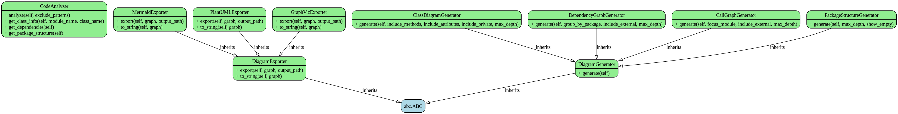

# PyArchViz Architecture

This document describes the architecture and design of PyArchViz.

## Overview

PyArchViz is a Python architecture visualization tool that analyzes Python codebases and generates various types of diagrams. The tool follows a modular pipeline architecture with clear separation of concerns.

## Architecture Diagram



## Core Components

### 1. Analyzer (`analyzer.py`)

The `CodeAnalyzer` class is responsible for parsing and analyzing Python source code.

**Key Responsibilities:**
- Traverse directory structure to find Python files
- Parse files using `astroid` for semantic analysis
- Extract structural information:
  - Classes with methods and attributes
  - Functions with parameters and return types
  - Import statements and dependencies
  - Call relationships between functions/methods
- Build internal representation of codebase structure

**Key Methods:**
- `analyze()` - Main entry point for analysis
- `get_class_info()` - Retrieve detailed class information
- `get_dependencies()` - Extract module dependencies
- `get_package_structure()` - Build hierarchical package tree

**Design Decisions:**
- Uses `astroid` instead of `ast` for better semantic analysis
- Gracefully handles syntax errors in individual files
- Caches parsed modules for efficient access
- Supports exclude patterns for filtering files

### 2. Generators (`generators.py`)

Diagram generators convert analyzed code structure into NetworkX graphs. Each generator inherits from the abstract `DiagramGenerator` base class.

#### ClassDiagramGenerator
Generates UML-style class diagrams showing:
- Classes with methods and attributes
- Inheritance relationships
- Type annotations

**Options:**
- `include_methods` - Show method signatures
- `include_attributes` - Show class attributes
- `include_private` - Include private members (starting with `_`)
- `max_depth` - Limit inheritance hierarchy depth

#### DependencyGraphGenerator
Creates module/package dependency graphs showing:
- Import relationships between modules
- Internal vs external dependencies
- Package grouping

**Options:**
- `group_by_package` - Group modules by parent package
- `include_external` - Show external (non-project) dependencies
- `max_depth` - Limit package hierarchy depth

#### CallGraphGenerator
Builds function/method call graphs showing:
- Function call relationships
- Call flow through the codebase

**Options:**
- `focus_module` - Limit to specific module
- `include_external` - Show external function calls
- `max_depth` - Maximum call depth

#### PackageStructureGenerator
Generates hierarchical package structure diagrams showing:
- Package/module organization
- Classes and functions within each module

**Options:**
- `max_depth` - Maximum package depth
- `show_empty` - Include empty packages

**Design Pattern:**
All generators follow the Strategy pattern, inheriting from a common base class and implementing the `generate()` method. This allows easy addition of new diagram types.

### 3. Exporters (`exporters.py`)

Exporters convert NetworkX graphs to various output formats. Each exporter inherits from the abstract `DiagramExporter` base class.

#### MermaidExporter
Exports to Mermaid markdown-compatible format:
- Class diagrams with UML syntax
- Flowcharts for call graphs
- Graph diagrams for dependencies

**Output:** `.mmd` files that can be rendered in GitHub, GitLab, etc.

#### PlantUMLExporter
Exports to PlantUML format:
- Class diagrams with detailed UML notation
- Component diagrams for architecture

**Output:** `.puml` files that require PlantUML to render

#### GraphVizExporter
Exports to images using GraphViz:
- Direct image generation (PNG, SVG, PDF, JPG)
- Multiple layout algorithms (dot, neato, fdp, etc.)
- Customizable node and edge styling

**Output:** Image files ready for presentations and documentation

**Design Pattern:**
Exporters use the Strategy pattern with a common interface. The Template Method pattern is used internally for format-specific rendering.

### 4. CLI (`cli.py`)

The command-line interface built with Click provides user-facing commands.

**Commands:**
- `generate` - Generate architecture diagrams
- `analyze` - Analyze code and show statistics
- `formats` - Display supported output formats

**Features:**
- Rich terminal output with progress indicators
- Extensive configuration options
- Beautiful table formatting for analysis results
- Error handling with helpful messages

**Design:**
- Uses Click for declarative command definition
- Rich library for terminal formatting
- Modular command structure for easy extension

## Data Flow

```
1. User Input (CLI)
   ↓
2. CodeAnalyzer
   - Find Python files
   - Parse with astroid
   - Extract structure
   ↓
3. Generator (selected type)
   - Process analyzed data
   - Build NetworkX graph
   ↓
4. Exporter (selected format)
   - Convert graph to format
   - Write to file
   ↓
5. Output (diagrams)
```

## Design Principles

### 1. Separation of Concerns
Each component has a single, well-defined responsibility:
- Analyzer: Code parsing and analysis
- Generators: Graph creation from analysis
- Exporters: Format conversion and output
- CLI: User interface and orchestration

### 2. Open/Closed Principle
The system is open for extension but closed for modification:
- New diagram types: Add new generator class
- New formats: Add new exporter class
- No changes to existing code required

### 3. Dependency Inversion
High-level modules depend on abstractions:
- Generators depend on `DiagramGenerator` interface
- Exporters depend on `DiagramExporter` interface
- CLI depends on abstract generator/exporter interfaces

### 4. Single Responsibility
Each class has one reason to change:
- `CodeAnalyzer` changes only if analysis logic changes
- Generators change only if diagram structure changes
- Exporters change only if output format changes

## Key Technologies

### astroid
- Python AST library with semantic analysis
- Better than `ast` for understanding code structure
- Handles type inference and name resolution

### NetworkX
- Graph library for representing diagrams
- Provides graph algorithms and data structures
- Format-agnostic internal representation

### Click
- CLI framework with declarative syntax
- Automatic help generation
- Type validation and conversion

### Rich
- Terminal formatting library
- Progress bars and spinners
- Colored output and tables

### GraphViz
- Graph visualization tool
- Multiple layout algorithms
- High-quality image output

## Extension Points

### Adding a New Diagram Type

1. Create a new generator class in `generators.py`:
```python
class MyNewGenerator(DiagramGenerator):
    def generate(self, **options):
        graph = nx.DiGraph()
        # Build your diagram
        return graph
```

2. Export it in `__init__.py`
3. Add CLI options in `cli.py`

### Adding a New Output Format

1. Create a new exporter class in `exporters.py`:
```python
class MyFormatExporter(DiagramExporter):
    def export(self, graph, output_path, **options):
        # Convert and save
        
    def to_string(self, graph, **options):
        # Return string representation
```

2. Export it in `__init__.py`
3. Add format option in `cli.py`

### Adding New Analysis Features

Extend `CodeAnalyzer` with new methods:
- Add data extraction in `_analyze_file()`
- Store in appropriate data structure
- Provide public accessor method

## Testing Strategy

### Unit Tests
- Test each component in isolation
- Mock dependencies using pytest fixtures
- Focus on edge cases and error handling

### Integration Tests
- Test full pipeline from analysis to export
- Use temporary directories for file I/O
- Verify output format correctness

### Example Projects
- `examples/sample_project` - Comprehensive test case
- Real-world structure with inheritance, imports, etc.
- Used for manual testing and demonstrations

## Performance Considerations

### Caching
- Parsed modules cached in memory
- Avoid re-parsing same file multiple times

### Lazy Evaluation
- Analysis only runs when needed
- Graph generation deferred until export

### Memory Management
- Stream processing for large projects
- Clear caches when appropriate

### Scalability
- Tested on projects with 100+ modules
- Efficient graph algorithms from NetworkX
- Parallel processing potential for future

## Future Architecture Improvements

### Planned Enhancements

1. **Plugin System**
   - Dynamic loading of generators/exporters
   - Third-party extensions
   - Configuration-based plugin registration

2. **Caching Layer**
   - Persistent cache for large projects
   - Incremental analysis (only changed files)
   - Cache invalidation strategies

3. **Async Processing**
   - Parallel file analysis
   - Async I/O for better performance
   - Progress tracking for long operations

4. **API Server**
   - REST API for diagram generation
   - Web-based UI
   - Integration with documentation systems

5. **Multi-Language Support**
   - Abstract language-specific analysis
   - Pluggable parsers for different languages
   - Unified graph representation

## Security Considerations

### Code Execution
- Parser only reads files, never executes code
- Safe for analyzing untrusted codebases

### File System Access
- Respects exclude patterns
- No write access outside output directory
- Follows symlinks safely

### Dependencies
- All dependencies from trusted sources
- Regular security updates via dependabot

## Contributing to Architecture

When proposing architectural changes:

1. **Maintain Separation of Concerns**
   - Keep components independent
   - Use clear interfaces

2. **Follow Existing Patterns**
   - Use Strategy pattern for variations
   - Abstract base classes for contracts

3. **Consider Extensibility**
   - Will others want to extend this?
   - Is the interface flexible enough?

4. **Document Decisions**
   - Update this document
   - Add docstrings to new components
   - Explain non-obvious choices

## References

- [Design Patterns](https://refactoring.guru/design-patterns)
- [SOLID Principles](https://en.wikipedia.org/wiki/SOLID)
- [NetworkX Documentation](https://networkx.org/documentation/stable/)
- [astroid Documentation](https://pylint.readthedocs.io/projects/astroid/)